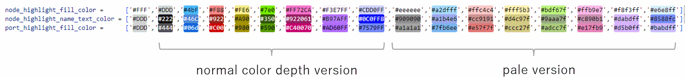

# HDElk mod


This is a fork of [HDElk](https://github.com/davidthings/hdelk).
Some features are added:

## 1. New features

1. arrow-head at edge termination
2. Bi-directional edge with `bidir` option (reverse is not supported)
3. multi-line node and edge label
4. show dimension in port and edge label with `rank` option (e.g.: `rank: [2,8]` automatically appends `[1:0][7:0]` to the label)
5. You can specify `thoroughness` layout algorithm parameter of ELK. `hdelk.layout(graph, "title", [thoroughness]);`
6. You can fix port orders (do not sort ports in layout calculation) per node.
7. C-style comments in `.jsonc` file (see: [C-style comments and Julia-based string interpolation](#2-c-style-comments-and-julia-based-string-interpolation))
8. Julia-based string interpolation (see: [C-style comments and Julia-based string interpolation](#2-c-style-comments-and-julia-based-string-interpolation))
9. new colors



## 2. C-style comments and Julia-based string interpolation

### 2.1. Prerequisites

This program is tested in the following environment:

- GNU bash 5.1.16
- GNU sed 4.8
- Python 3.10.13
- Julia 1.10.2

### 2.2. How to use

1. Put constants used in JSONC file in `constants.jl`. This `.jl` file should be placed in the same directory as the target JSONC file.
   Example usage is shown in `example/constants.jl`.
2. Write the target JSONC file.
In this file, the HDElk syntax is valid.
In addition, the following features can be used:

    1. C-style comments (`/* ... */`)
    2. Julia string interpolation (`$(...)`)

   Example usage is shown in `example/example_count.jsonc`.
3. Run the following command:

    ```bash
    py_scripts/jsonc2html.py <path to the target JSONC file>

    # example:
    # $ py_scripts/jsonc2html.py example/example_count.jsonc
    ```

    The intermediate `julia_code.jl` is generated and Julia runs it.

4. The generated HTML file's base name is the same as that of the input JSONC file.
To render this HTML file, make sure that **HDElk's `js` folder is in the same directory as the HTML file** (or you can modify the js library path in the html template in `jsonc2html.py` script, or manually edit the generated html file).

## 3. modified files

- `js/hdelk.js`
