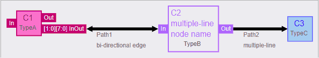

# HDElk mod

This is a fork of [HDElk](https://github.com/davidthings/hdelk).
The following features are added:

1. arrow-head at edge termination
2. Bi-directional edge with `bidir` option (reverse is not supported)
3. multi-line node and edge label
4. show bit-width in port label with `rank` option (e.g.: `rank: [2,8]` automatically appends `[1:0][7:0]` to the label)
5. new colors

## modified files

* `js/hdelk.js`
